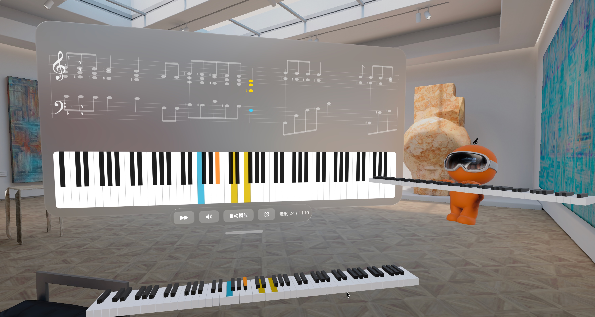

# HappyPianist

HappyPianist 是一个面向 Apple Vision Pro 的钢琴练习应用。它把 MusicXML 转成空间练习引导，并支持音频、蓝牙 MIDI 与虚拟钢琴三种输入方式。



## 当前能力

- 批量导入 `.musicxml`、`.xml`、`.mxl` 曲谱，以原文件名同卷暂存并逐项建立曲库；同名冲突先停在确认边界，不会静默改名或覆盖。
- App 启动后直接进入曲库；左上角“选择钢琴”和“开始练习”分别通过单层 `pushWindow` 打开准备窗口与练习窗口，关闭后恢复原曲库状态。
- 记录小节级练习事实，恢复上次片段与位置。
- 将连续演奏对齐为按输入能力裁剪的客观 assessment，并展示一个可执行练习建议、非模态即时反馈、练习总结与小节恢复地图。
- 在沉浸空间显示键位高亮与轻量恢复效果。
- 记录结构化诊断事件，并允许用户导出最近七天的安全诊断日志。
- 练习中录制、回放并导出 MIDI take。
- AI 对弹支持本地规则、本地 CoreML，以及可选的 Mac 侧 Aria v2 网络后端。

## 仓库结构

```text
HappyPianist.xcodeproj      visionOS 工程
HappyPianistAVP/            App 源码
HappyPianistAVPTests/       Swift Testing 测试
Packages/RealityKitContent/ RealityKit 内容包
python_backend/             可选的 Aria v2 本地服务与工具
docs/                       项目知识库
```

当前工程只有 `HappyPianistAVP` 与 `HappyPianistAVPTests` 两个 target；仓库中没有 macOS App target。架构、数据流、配置和测试入口见 [`docs/overview.md`](docs/overview.md)。

## 环境要求

- 支持 visionOS 26.0 SDK 的 Xcode
- visionOS Simulator 或 Apple Vision Pro
- Swift 6
- 可选：Python 3.11+ 与 `uv`，仅用于 Aria v2 网络后端

## 资源状态

仓库已包含 `HappyPianistAVP/Resources/Fonts/Bravura.otf`。以下私有或体积较大的资源不随源码分发：

| 资源 | 影响 |
| --- | --- |
| `HappyPianistAVP/Resources/SeedScores/` | 没有内置生产曲目；依赖私有曲谱的资源集成测试会跳过。 |
| `SalC5Light2.sf2` | 本地 sampler 无法加载钢琴音色。 |
| `AIDuetPerformanceRNN.mlpackage` / `.mlmodelc` | 本地 CoreML 对弹不可用；仍可使用本地规则或网络后端。 |

将所需资源加入 `HappyPianistAVP` target 后再进行对应验收。测试跳过不等于资源集成通过。

## 构建与测试

日常开发优先使用根目录 Makefile：

```bash
make doctor
make destinations
make build
make test
```

## 可选：启动 Aria v2 网络后端

```bash
cd python_backend/aria_server
uv sync

cd ..
uv run --project aria_server \
  python scripts/aria_server.py \
  --host 0.0.0.0 \
  --port 8766
```

模型权重默认路径是 `python_backend/aria/hf/model-demo.safetensors`，不会随仓库分发。详细说明见 [`python_backend/README.md`](python_backend/README.md)。

## 致谢

- [Anticipation](https://github.com/jthickstun/anticipation) 与 [Anticipatory Music Transformer](https://arxiv.org/abs/2306.08620)
- [stanford-crfm/music-large-800k](https://huggingface.co/stanford-crfm/music-large-800k)
- Apple CoreMIDI、RealityKit、ARKit 与 Salamander Grand Piano 音色采样
- 感谢南客松 S2、`njuer勇闯互联网`、`罗恩`、`大宝哥` 对项目的支持

## 许可证

本项目基于 [AGPL-3.0](LICENSE.APGLv3) 开源。
