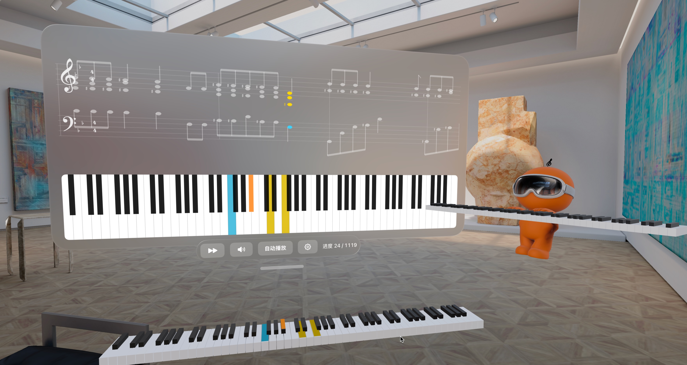

# HappyPianist

[English](./README.en.md) | 中文

HappyPianist 是一个钢琴练习应用。



## 快速开始

```bash
make build      # visionOS Simulator
make test       # visionOS Simulator tests
make build:mac  # 独立 macOS MusicXML/MIDI/曲目音频 host
make test:mac   # macOS host tests
```

共享 Swift package 可单独验证：`swift test --package-path Packages/HappyPianistCore`。运行边界、数据契约和硬件证据见[项目概览](docs/overview.md)。

## 致谢

- [Anticipation](https://github.com/jthickstun/anticipation) 与 [Anticipatory Music Transformer](https://arxiv.org/abs/2306.08620)
- [stanford-crfm/music-large-800k](https://huggingface.co/stanford-crfm/music-large-800k)
- Salamander Grand Piano 音色采样
- 感谢南客松 S2、`njuer勇闯互联网`、`罗恩`、`大宝哥` 对项目的支持

## 许可证

本项目基于 [AGPL-3.0](LICENSE.APGLv3) 开源。
