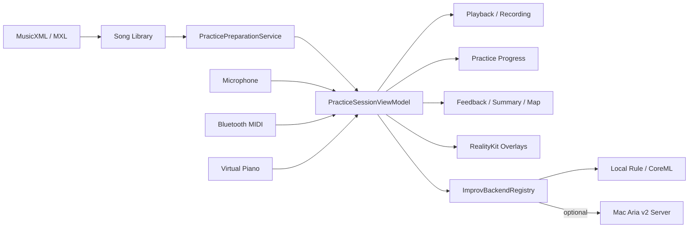
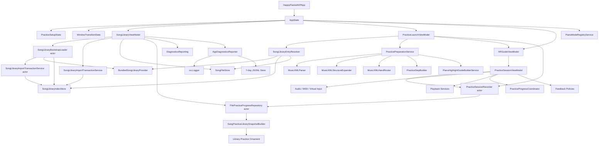

# 架构

## 系统上下文

## 运行时边界

| 单元 | 位置 | 核心职责 |
| --- | --- | --- |
| visionOS App | `HappyPianistAVP/` | 三窗口流程、沉浸空间、曲库、练习、录制与 AI 对弹。 |
| visionOS Tests | `HappyPianistAVPTests/` | 业务逻辑和 Apple target 集成测试。 |
| RealityKit 内容包 | `Packages/RealityKitContent/` | Reality Composer Pro 资产和 bundle。 |
| Python 服务（可选） | `python_backend/` | Aria v2 推理、Bonjour、HTTP/WS 与 smoketest。 |

## App 依赖图

`LiveAppGraph.make()` 是 live app 的 composition root。新增服务必须在创建它的 task 中完成注入和消费；不要留下未接入的协议或实现。

## 窗口与空间

`HappyPianistAVPApp` 声明：

- `preparation` window
- `library` window
- `practice` window
- mixed `ImmersiveSpace`

`WindowTransitionState` 记录显式窗口切换事务，由目标根视图消费并关闭来源窗口。`PracticeLaunchViewModel` 是曲谱准备 request、激活、失败、恢复与 prepared-song 清理的唯一 owner；`PracticeWindowRootView` 是练习 leave、immersive close/recover 与返回曲库的唯一 owner。`ARGuideViewModel` 协调沉浸空间、追踪、练习 session、录制与 AI 服务。`ARTrackingRequirements` 从当前流程推导最小 provider 集合；后台或退出沉浸空间时统一暂停追踪、输入消费者和 RealityKit 长生命周期任务，恢复 active 后按当前 request 重建。

## 主要领域边界

| 边界 | 核心类型 | 说明 |
| --- | --- | --- |
| 曲库 | `SongLibraryEntry`、`SongLibraryIndex` | bundled 与用户导入曲目的统一索引；entry version token 标识文件版本。 |
| 曲库练习展示 | `SongPracticeLibraryPresentationState`、`LibraryPracticeProgressOrnamentView` | 从单曲 history 纯派生四态最终 presentation，并在 trailing Ornament 只读展示；不持久化 UI summary。 |
| 曲谱准备 | `PreparedPractice`、`PracticePreparationService` | MusicXML 到 steps、measure spans、timelines、guide 与 notation 输入。 |
| 练习配置 | `PracticeRoundConfigurationController` | pending 与 active round configuration。 |
| 范围 | `PracticeMeasureIndex`、`PracticeActiveRange` | 小节、step、回放、谱面和完成边界的统一投影。 |
| 判定 | `StepAttemptMatchResult`、matcher/accumulator | 输入证据转换为 typed attempt outcome。 |
| 进度与会话 | `SongPracticeProgress`、`SongScorePracticeMetadata`、`PracticeSessionRecord` | 同一严格 JSON schema 内的小节事实、曲谱 metadata、恢复点与原始会话事实。 |
| 会话记录 | `PracticeSessionRecorder` | composition root 持有的 window-visit actor；跨 `PracticeSessionViewModel` replacement 计时并 checkpoint。 |
| 反馈 | feedback policies、view models | 从 durable facts 派生 cue、summary、map 和空间效果。 |
| 录制 | `RecordingTakeRecorder`、`RecordingTakeStore` | 练习中的 MIDI 风格事件记录、回放与导出。 |
| AI | `ImprovBackendRegistry`、`AIPerformanceService` | 严格使用用户选择的本地或网络后端。 |
| 诊断 | `DiagnosticEvent`、`AppDiagnosticsReporter`、`FileDiagnosticsStore` | 单一事件入口分发到系统日志与受筛选的七天可导出日志。 |

## 关键不变量

- 正式曲谱来源是 MusicXML；可进入练习的 prepared result 必须同时有 steps 与 measure spans。
- `PracticeStep` 是即时判定单位；持久化事实聚合到 source measure。
- 重复结构用 occurrence identity 定位播放位置，用 source identity 汇总学习事实。
- 本轮 active configuration 在一轮中不可变；设置修改只影响下一轮。
- 退出、后台、换 session 与完成流程必须先停止新 attempt，再 flush 进度，最后 teardown 输入、追踪、RealityKit task 和回放。
- 手部热路径只传递 `FingerTipsSnapshot`；订阅使用 newest-only current-value relay，消费者不得恢复字符串字典协议。
- CoreMIDI 输入流必须有固定容量；发生溢出时以 channel-wide All Notes Off 作为状态恢复边界。
- 曲库 bootstrap 固定先由唯一 `SongLibraryImportTransactionService` 恢复未完成事务，再读取 index，最后扫描 bundle；恢复被阻塞时不得发布任何新 snapshot，也不得放回 ViewModel 初始化或 SwiftUI `body`。
- bootstrap loader、Library ViewModel 与后续 resolver 必须复用 composition root 注入的同一个 `SongLibraryIndexStore` 和 bundled provider；索引写入只能通过 actor 内 concern mutation，损坏 JSON 必须 fail closed 并保留原文件。
- score replacement 使用 song ID、旧 version token 与旧文件名三项 exact CAS，只更新文件名、导入时间与新 token；entry 顺序、显示名、音频、bundled 标志和 last-selected 原位保留。
- `SongLibraryViewModel` 只在 MainActor 编排；score 导入的 security scope、同卷 stage、指纹、target/index commit 与恢复全部由唯一 `SongLibraryImportTransactionService` actor 执行。`SongFileStore` 只保留已入库 score/audio URL 解析与删除；音频复制归 `AudioImportService`。
- 批量导入队列只保存 operation ID，不跨 actor await 保留外部 URL。队列非 idle 时开始练习和用户曲目删除在 UI 与 MainActor intent 两层同时门控；选曲与试听仍可用。
- feedback 表现不进入 progress JSON。
- AI 失败不改变练习进度，也不自动切换后端。
- 曲谱准备失败的界面说明、技术详情、系统日志和导出日志必须来自同一个 typed failure。
- 曲库 selection 只更新内存并异步持久化；不得触发 resolver、曲谱准备或 ARGuide。只有练习窗口激活 registered request 后才执行这些副作用。
- trailing Ornament 只能消费 `loading`、`invitation`、`overview`、`unavailable` 最终 presentation；不得持有 launch owner、配置 controller、score service、MusicXML parser 或第二个练习入口。
- `PracticeSessionRecorder` 由 `LiveAppGraph` 按 Practice window visit 共享；首次真实进入 guiding 才创建会话，同一窗口的多轮练习或 ViewModel replacement 不得拆分会话。
- 会话 active duration 只累计 scene active、guiding 且设置未覆盖的单调时钟增量；生命周期边界立即 checkpoint，连续 guiding 最多每 30 秒 checkpoint。
- 同 revision 的无效 passage/resume 必须回退到当前曲谱的整首配置并立即 checkpoint；小节事实继续保留。
- progress repository 的 progress、metadata、session mutation 必须保留另外两类 concern；三数组 schema 缺字段或损坏时 fail closed，exact duplicate 使用共享确定性 order，调用方不得整份覆盖。
- 诊断文件只接收低频且明确可导出的事件，不保存绝对路径或原始演奏数据。

## 高风险修改区

| 区域 | 风险 | 最低验证 |
| --- | --- | --- |
| `PracticePreparationService` | parser、repeat、手别、tempo、guide 与 identity 全链路 | MusicXML + preparation tests |
| `PracticeSessionViewModelCommands` | range、resume、round、completion 与 feedback 生命周期 | session + progress + feedback tests |
| `PracticeAttemptReducer` | streak、稳定状态与错误事实 | reducer tests |
| `PracticeProgressCoordinator` | 乱序 load/save、flush 与跨曲污染 | delayed repository tests |
| `PracticePlaybackControlService` | tempo、片段边界、pedal 与输入抑制 | playback/autoplay tests |
| MIDI/audio matcher | 错音、漏音、和弦与证据不足 | matcher tests |
| `ARGuideViewModel` / `ImmersiveView` | scenePhase、tracking 和 overlay 清理 | Simulator + Vision Pro |
| `SongLibraryViewModel` | 导入、删除、试听、唯一 selection 与独立异步持久化 | library + selection tests |
| `PracticeLaunchViewModel` | request generation、prepare/apply 竞态、失败、scene suspend 与 return 清理 | launch + lifecycle tests |

## 验证分层

1. 纯 Swift：模型、reducer、range、matcher、repository、policy。
2. Xcode target：完整类型检查、资源、SwiftUI、RealityKit、AVFoundation、CoreMIDI 集成。
3. Simulator / Vision Pro：窗口、生命周期、声音、MIDI、手部追踪、空间对齐与舒适度。
