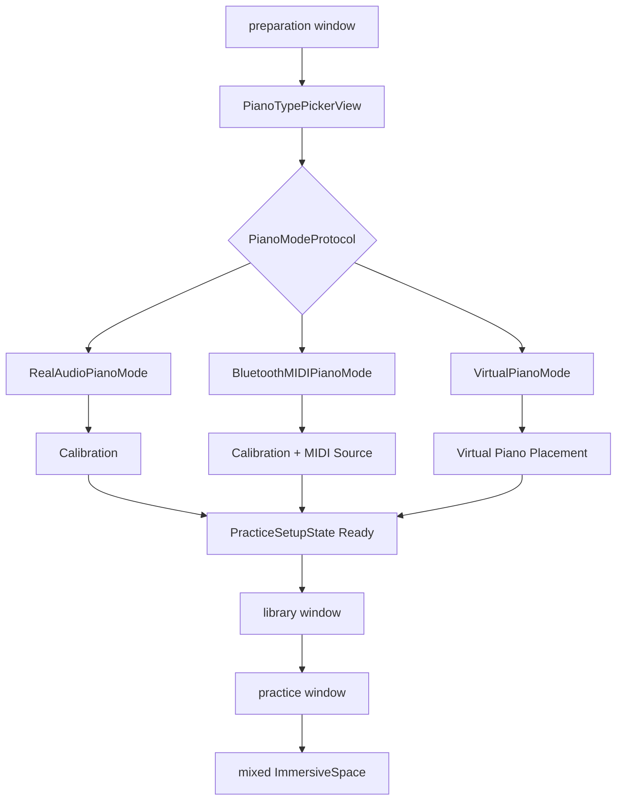
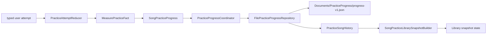
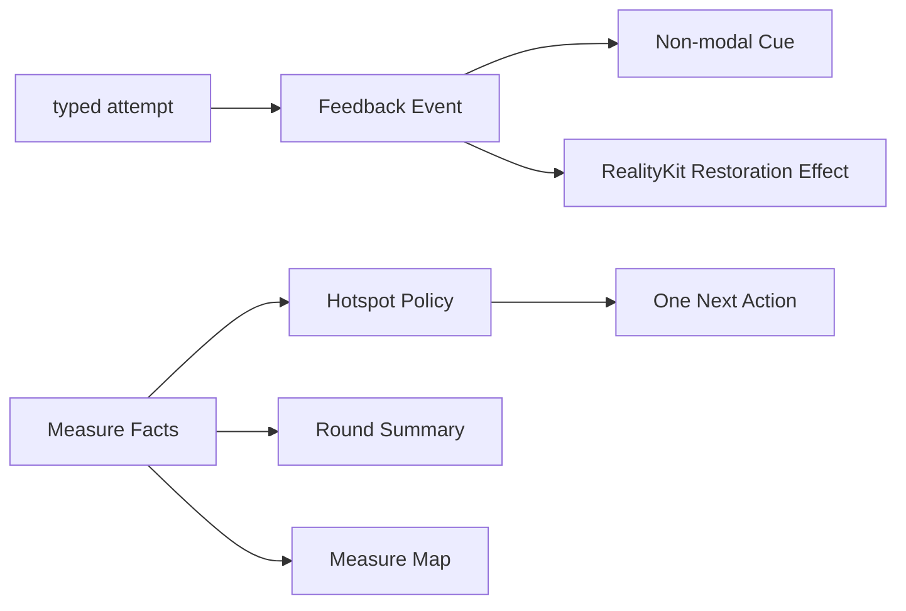
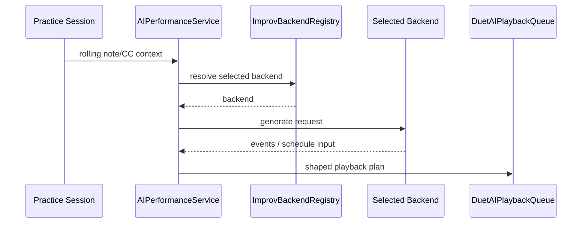

# 数据流

本文只描述当前存在的 visionOS 运行链路。

## 主流程

| 流程 | 入口 | 关键对象 | 输出 |
| --- | --- | --- | --- |
| 准备 | 钢琴模式选择 | `PracticeSetupState`、`PianoModeProtocol` | readiness gate |
| 曲库 | bundled / 用户导入 MusicXML | `SongLibraryBootstrapLoader`、`SongLibraryViewModel`、`SongLibraryImportTransactionService` | `SongLibraryEntry` |
| 曲谱准备 | 练习窗口激活已登记 request | `PracticeLaunchViewModel`、`PracticePreparationService` | loading / ready / typed failure |
| 练习 | ready prepared score + piano mode | `ARGuideViewModel`、`PracticeSessionViewModel` | 导航、判定、回放、录制 |
| 持久化 | attempt 与 session 生命周期 | reducer、coordinator、repository | 小节事实与恢复点 |
| 正反馈 | durable facts + typed attempt | feedback policies / view models | cue、summary、map、空间效果 |
| AI 对弹 | rolling context | `AIPerformanceService`、`ImprovBackendRegistry` | playback schedule |

## 窗口与准备



`WindowTransitionState` 维护 preparation、library、practice 三个窗口的显式切换事务；目标窗口出现后关闭来源窗口。ARKit provider 只在沉浸空间内启动，并由 `ARTrackingRequirements` 按校准、练习模式和虚拟琴摆放阶段选择 hand、world 与 horizontal-plane provider。练习窗口 scenePhase 进入非 active 时取消正在进行的 preparation 并 flush session，但保留 request；恢复 active 后重新激活同一 request。

## MusicXML 导入与准备

### 启动与导入

```text
SongLibraryView.task
-> SongLibraryViewModel.loadLibraryIfNeeded
-> SongLibraryBootstrapLoader actor
-> SongLibraryImportTransactionService.recoverPendingTransactions
-> injected shared SongLibraryIndexStore actor
-> BundledSongLibraryProvider
-> loaded snapshot，或保留内存状态并显示可重试的 blocked failure
```

```text
LibraryWindowView / SongLibraryView
-> SongLibraryViewModel.importMusicXML
-> SongLibraryImportTransactionService.stageImports
-> 短 security lease + transactions/<operation-id>/stage/.partial
-> 原名 stage + journal fingerprint
-> operation-ID 单写者队列逐项 process
-> 读取最新 index 与目标卷 resource identity facts
-> 无冲突：原名 target move -> SongLibraryIndexStore append -> cleanup
-> 冲突：target/index 零 mutation，等待取消或后续确认
```

`SongLibraryImportTransactionService`、`SongFileStore` 与 `AudioImportService` 都是 actor；Library MainActor 不执行 Documents IO、security-scope access、copy 或 delete。`SongFileStore` 不再拥有 score import API。试听 URL await 返回后还必须匹配最新 intent、entry 和 audio filename，旧结果静默丢弃。

score import 只有 transaction service 一条写入路径；`.mxl` 在 preparation 阶段通过 `MXLReader` 解包。

### 准备管线

| 阶段 | 关键对象 | 产物 |
| --- | --- | --- |
| 读取 | `SongLibraryEntryResolver`、`BundledSongLibraryProvider`、`SongFileStore` | 已验证的 score URL |
| 解析 | `MusicXMLParser`、`MXLReader` | score model |
| 钢琴归一化 | `MusicXMLPianoGrandStaffNormalizer` | 双谱表结构 |
| 展开 | `MusicXMLStructureExpander` | repeat / ending 后的 occurrence 序列 |
| 时间语义 | tempo、pedal、fermata、attribute、slur timelines | 回放和谱面上下文 |
| 分手与 step | `MusicXMLHandRouter`、`PracticeStepBuilder` | `PracticeStep[]` |
| 小节身份 | `MusicXMLMeasureSpan`、`PracticeMeasureIndex` | source / occurrence 映射 |
| 高亮与谱面 | guide builder、notation layout | 键位 guide 与五线谱输入 |
| session 注入 | `PracticeSessionViewModel` | 可开始的一轮练习 |

正式 preparation 结果必须同时有可演奏 steps 和 measure spans。解析失败或缺少小节结构时应返回具体错误，不进入推测性的兼容模式。

曲库选择链路：

```text
选择唱片
-> SongLibraryViewModel 立即发布唯一 selectedEntryID
-> 独立 debounce 唤醒单写者 drain loop
-> SongLibraryIndexStore actor 保存最新 desired lastSelectedEntryID
-> 用户点击唯一的“开始练习”按钮
-> LibraryWindowRootView 同步登记 PracticeLaunch request 后打开 practice window
-> PracticeWindowRootView 激活 request
-> resolver -> PracticePreparationService -> steps/spans 校验
-> ARGuide apply 并恢复精确 song UUID + revision 的配置与位置
-> apply 成功后立即 ready，并异步 best-effort upsert score metadata
-> ready 后才挂载 PracticeStepView
```

SwiftUI View 与 `LibraryCrateView` 不保存第二份 selection；点击、拖动、上一首/下一首和 VoiceOver adjustable action 都只发送 `selectEntry` intent。持久化 worker 同时最多执行一个 mutation，旧写返回后会继续 drain 最新 desired selection；窗口消失时显式 flush。selection 保存尚未完成或失败都不阻塞启动，因为按钮传递当前内存 song ID。trailing Ornament 只读消费 snapshot state，不保存配置，也不提供第二个练习入口。

当前曲目练习事实读取与 selection 持久化使用彼此独立的 generation：

```text
selected song UUID + entry version token
-> 短 settle delay
-> FilePracticeProgressRepository.history（actor 内 JSON decode/filter）
-> nonisolated SongPracticeLibrarySnapshotBuilder（纯 facts 派生）
-> UUID + token + generation 仍一致时发布 snapshot state
```

Library 返回前台时会刷新同一 selection；同一 run-loop 的 `onAppear` / active refresh 会取消并合并到最新 generation。损坏 history 只产生 `unavailable` 与 typed diagnostic，不设置全局错误，也不禁用试听或唯一开始按钮。该路径不解析曲谱、不访问 score URL、`PreparedPractice` 或 session。trailing Ornament 渲染 no selection、loading、never practiced、current、needs rebuild 与 unavailable 六类只读状态；Reduce Motion 使用静态 phase，VoiceOver 和 Differentiate Without Color 不依赖颜色传达事实。

## 本轮配置与 active range

```text
UserDefaults defaults
-> pending PracticeRoundConfiguration
-> apply / restart
-> immutable active configuration
-> PracticeActiveRange
```

active range 同时约束：

- step 导航
- 当前谱面视口
- 琴键高亮
- autoplay
- manual replay
- 一轮完成边界

手别、速度、循环和成功目标只在应用 pending 配置并开始新一轮时生效。

## 输入与 typed attempt

| 模式 | 输入链路 | 判定 |
| --- | --- | --- |
| 真实钢琴（音频） | microphone -> recognition service -> accumulator | 目标音证据与 typed outcome |
| 真实钢琴（蓝牙 MIDI） | CoreMIDI -> bounded MIDI1/2 stream -> decoder -> input service | deterministic note/chord matching |
| 虚拟钢琴 | newest-only `FingerTipsSnapshot` -> indexed hand contact -> virtual input controller | 虚拟按键 note events |

手部 producer 只发布 typed snapshot；琴键几何变化时重建一次 hit-test index，每帧仅查询相邻候选键。CoreMIDI 缓冲溢出会发布 All Notes Off，统一复位 matcher、AI 持音上下文和录音中的开放音符。自动播放、手动回放、AI 输出、paused、suspended 与非 guiding 状态不会生成用户 attempt。

## 练习事实与恢复



规则：

- `PracticeStep` 是即时判定单位。
- source measure 是持久化学习单位。
- occurrence identity 只负责重复结构中的播放位置。
- streak 按手别、速度与本轮条件隔离。
- resume point 保存片段、配置与当前 step。
- 恢复完成后停在 ready/paused，不自动发声。
- back、background、换 session 与完成时等待 flush。

## 正反馈



反馈是事实的派生表现：

- 一次只选择一个主要卡点和一个下一步。
- 无证据时不制造问题。
- cue、summary、map 与空间效果不写入 progress JSON。
- 换曲、restart、进入后台、关闭窗口和退出沉浸空间会清理反馈 presentation。

## 录制与回放

蓝牙 MIDI 与虚拟键事件可进入：

```text
MIDIRecordingAdapter
-> RecordingTakeRecorder
-> RecordingTakeStore
-> Documents/TakeLibrary/takes.json
```

`TakePlaybackController` 复用 sequencer 回放；`RecordingMIDIExportService` 导出 `.mid`。

## AI 对弹

后端由 `practiceImprovBackendKind` 选择：

- 本地规则：`LocalRuleImprovBackend`
- 本地 CoreML：`LocalCoreMLDuetImprovBackend`
- Aria v2 HTTP：Bonjour + `POST /generate`
- Aria v2 Streaming：Bonjour + WebSocket `/stream`



后端失败只更新状态并停止该次生成，不自动降级到另一个后端，也不写入练习进度。


## 诊断事件与导出

```text
Typed domain failure
-> DiagnosticEvent
-> AppDiagnosticsReporter
   -> OSLogDiagnosticsSink
   -> FileDiagnosticsStore（仅 exportable）
```

曲谱准备失败使用同一个 `PracticeLaunchFailure` 生成练习窗口错误界面、可选择复制的技术详情和诊断事件。重试创建新的 generation 与事件 ID；取消或 stale generation 不记录失败。无效的同版本 passage/resume 会在内存回退到安全整首配置；落盘成功记录 `practiceSavedConfigurationRepaired`，落盘失败则记录 `practiceSavedConfigurationRepairFailed`，两者都允许 launch 进入 ready，但后者明确提示下次可能再次修复。

用户通过曲库顶部“诊断”入口管理日志。导出动作在本地生成 ZIP，不自动上传。日志默认保留7 个日历日，并排除绝对路径、原始 MusicXML、逐音 MIDI、音频样本、手部帧、AI 正文和凭据。
