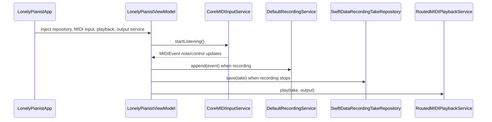
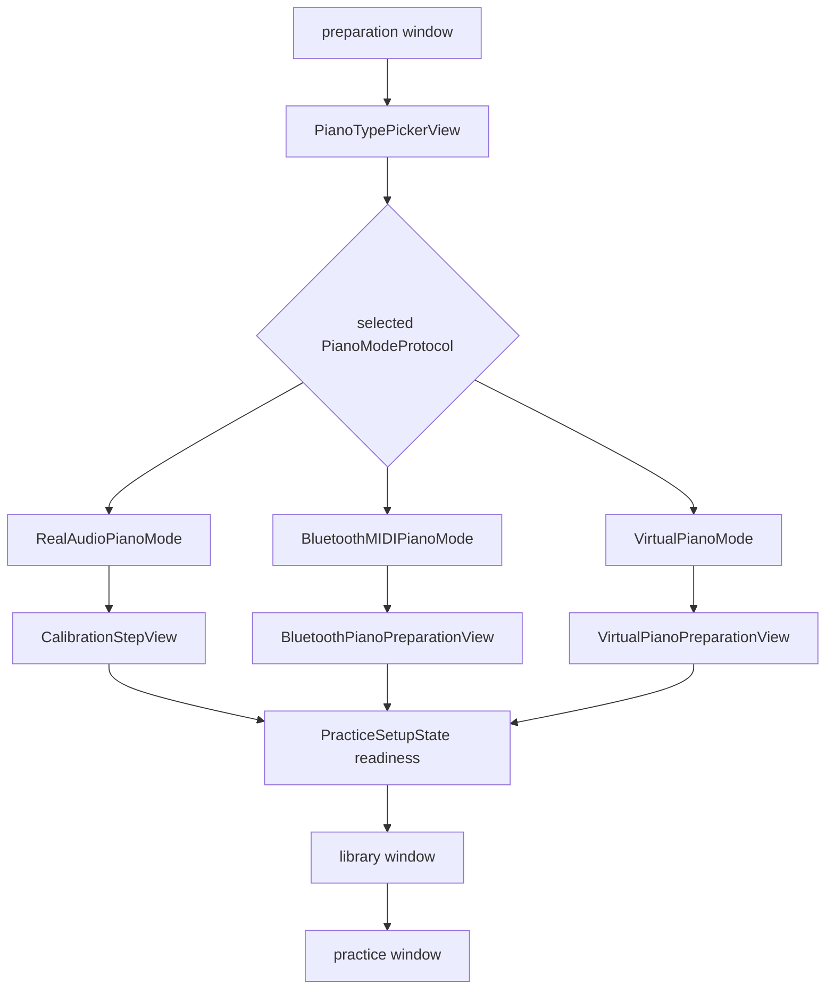
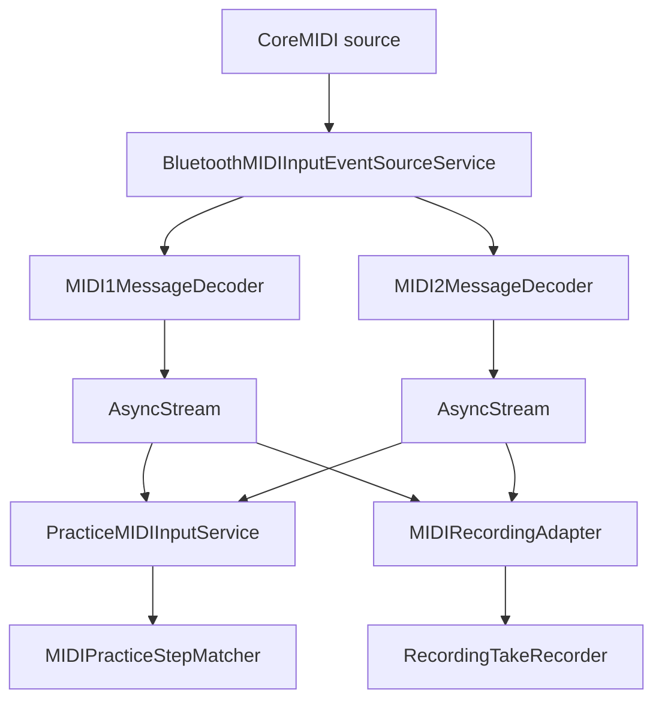
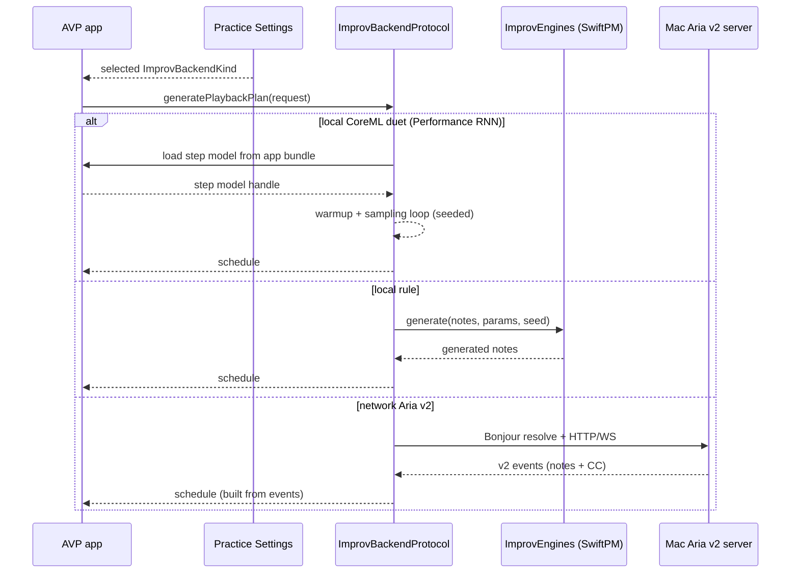

# 数据流

本文只描述当前代码存在的运行链路。macOS 端不再包含 MIDI mapping、键盘注入或 AVP 的网络后端 client；visionOS 端（AVP）的 AI 即兴链路包含：

- 本地生成后端（CoreML / SwiftPM rule）
- 可选网络后端（Aria v2：Bonjour 发现 + HTTP `/generate` + WebSocket `/stream`，由 Mac 侧 `python_backend/aria_server/` 提供）

无论本地/网络后端，AVP 都严格只使用用户在 practice 设置中选择的后端（失败只提示，不自动降级/切换）。

## 主流程

| 流程 | 入口 | 关键对象 | 输出 |
| --- | --- | --- | --- |
| macOS MIDI 监听 | CoreMIDI source | `CoreMIDIInputService` -> `LonelyPianistViewModel` | UI pressed notes、事件计数、录制输入 |
| macOS take 录制 | record button + MIDI note events | `DefaultRecordingService` | `RecordingTake` |
| macOS MIDI 导入 | `.mid` / `.midi` 文件 | `MIDIFileImporter` | take 列表中的导入 take |
| macOS 回放 | selected take | `RoutedMIDIPlaybackService` | 内建 sampler 或外部 MIDI destination |
| AVP 准备 | 钢琴类型选择 | `PracticeSetupState` + `WindowTransitionState` | 进入曲库前的 readiness gate |
| AVP 曲库 | bundled MusicXML / 用户导入 MusicXML | `SongLibraryViewModel` + `PracticePreparationService` | `PreparedPractice` |
| AVP 练习 | `PreparedPractice` + selected piano mode | `ARGuideViewModel` + `PracticeSessionViewModel` | 步骤推进、谱面、高亮、录制与回放 |
| AVP AI 即兴 | rolling note/CC context | `AIPerformanceService` + `ImprovBackendRegistry` | 连续评估、短窗生成、整形后送入可替换调度器（严格按所选后端） |

## macOS recorder

录制数据最终写入 SwiftData store；回放可路由到 `AVSamplerMIDIPlaybackService` 或 `CoreMIDIOutputMIDIPlaybackService`。

## AVP 窗口与准备

`LonelyPianistAVPApp` 声明 `preparation`、`library`、`practice` 三个窗口和一个 `ImmersiveSpace`。窗口切换不依赖旧 `FlowState`；当前状态由 `PracticeSetupState` 与 `WindowTransitionState` 承载。

## AVP MusicXML 到练习

| 阶段 | 关键对象 | 结果 |
| --- | --- | --- |
| 导入/读取 | `MusicXMLImportService`、`MXLReader`、`BundledSongLibraryProvider` | MusicXML score |
| 乐谱归一化 | `MusicXMLPianoGrandStaffNormalizer`、`MusicXMLStructureExpander` | 面向钢琴练习的 score |
| 语义提取 | `MusicXMLTempoMap`、`MusicXMLPedalTimeline`、`MusicXMLFermataTimeline`、`MusicXMLAttributeTimeline`、`MusicXMLSlurTimeline`、`MusicXMLWordsSemanticsInterpreter` | timing、踏板、延音、表情信息 |
| 分手与 step | `MusicXMLHandRouter`、`PracticeStepBuilder`、`MusicXMLNoteSpanBuilder` | `PracticeStep[]`、note spans |
| 高亮与谱面 | `PianoHighlightGuideBuilderService`、`GrandStaffNotationLayoutService` | key guides、grand staff notation |
| session 注入 | `PracticeSessionViewModel` | 练习状态与 effect 队列 |

## AVP 输入源

| 模式 | 追踪模式 | 输入处理 | 说明 |
| --- | --- | --- | --- |
| 真实钢琴（音频） | `.practiceVirtualOrAudio` | `PracticeAudioRecognitionInputService` | 基于目标音的 harmonic template detector 推进 step。 |
| 真实钢琴（蓝牙 MIDI） | `.practiceBluetoothMIDI` | `PracticeMIDIInputService` | 使用 CoreMIDI MIDI 1.0/2.0 note-on 匹配 step；不启用手部按键 consumer。 |
| 虚拟钢琴 | `.practiceVirtualOrAudio` | `VirtualPianoInputController` + `KeyContactDetectionService` | 先放置 3D 88 键键盘，再用手部接触生成按键事件。 |

## BLE MIDI 输入链路

端点报告 MIDI 2.0 且 MIDI 2.0 input port 可用时订阅 MIDI 2.0，否则订阅 MIDI 1.0。调试日志带 `debugEventID` 和 source 归因，用于定位端点协议切换或事件丢弃。

## AI 即兴链路

practice 窗口的 settings popover 中可选择后端：

- `本地 CoreML（A.I. Duet / Performance RNN）`：AVP 端使用 CoreML 运行 Performance RNN 单步模型做自回归采样；模型文件（`AIDuetPerformanceRNN.mlpackage` / `AIDuetPerformanceRNN.mlmodelc`）不入库，由开发者本地放置并加入 Xcode target。
- `本地规则生成（Local rule）`：AVP 端直接调用 SwiftPM `ImprovEngines`（seed 可复现）。
- `网络本地连接（Aria v2）`：AVP 通过 Bonjour 发现 `_lpduet._tcp` 服务并调用 HTTP `POST /generate` 获取 v2 events。
- `网络本地连接（Aria v2 Streaming）`：AVP 通过 Bonjour 获取 `ws_path` 并用 WebSocket `GET /stream` 接收 v2 chunk events（更快开声）。

本地规则生成由 SwiftPM（`Packages/ImprovEngines/`）提供。当前默认后端为本地 CoreML；若未放置模型文件，UI 会提示缺失，并可手动切换到本地 rule。
