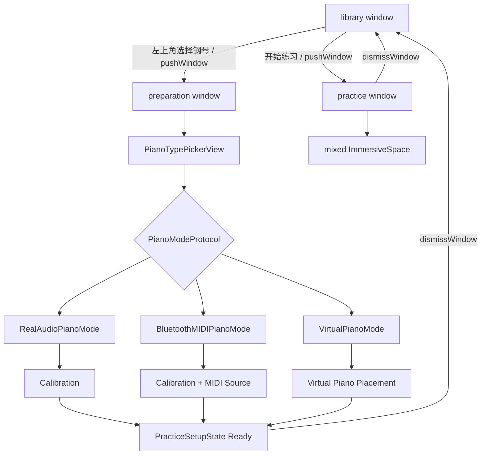
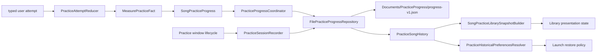
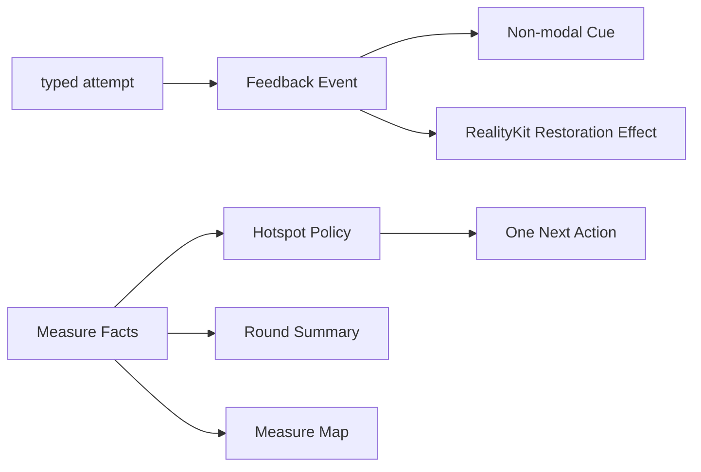
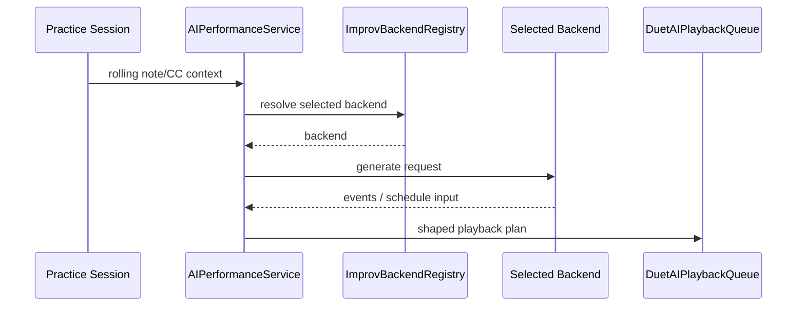

# 数据流

本文只描述当前存在的 visionOS 运行链路。

## 主流程

| 流程 | 入口 | 关键对象 | 输出 |
| --- | --- | --- | --- |
| 准备 | 钢琴模式选择 | `PracticeSetupState`、`PianoModeProtocol` | readiness gate |
| 曲库 | bundled / 用户导入 MusicXML | `SongLibraryBootstrapLoader`、`SongLibraryViewModel`、`SongLibraryImportTransactionService` | `SongLibraryEntry` |
| 曲谱准备 | 练习窗口激活已登记 request | `PracticeLaunchViewModel`、`PracticePreparationService` | loading / ready / typed failure |
| 练习 | ready prepared score + piano mode | `ARGuideViewModel`、`PracticeSessionViewModel` | 导航、判定、回放、录制 |
| 持久化 | attempt 与 session 生命周期 | reducer、coordinator、repository | 小节事实与恢复点 |
| 正反馈 | durable facts + typed attempt | feedback policies / view models | cue、summary、map、空间效果 |
| AI 对弹 | rolling context | `AIPerformanceService`、`ImprovBackendRegistry` | playback schedule |

## 窗口与准备



App 启动时直接显示 Library。钢琴准备与 Practice 都由 Library 以 `pushWindow` 单层压入；完成设置或退出练习时关闭当前 pushed window 并恢复保留原状态的 Library。`PianoSetupCoordinator` 只维护钢琴模式 registry、readiness 状态与重置行为，不记录窗口来源/目标。未满足所选钢琴模式 readiness 时，Library 禁用“开始练习”。ARKit provider 只在沉浸空间内启动，并由 `ARTrackingRequirements` 按校准、练习模式和虚拟琴摆放阶段选择 hand、world 与 horizontal-plane provider。练习窗口 scenePhase 进入非 active 时取消正在进行的 preparation 并 flush session，但保留 request；恢复 active 后重新激活同一 request。

## MusicXML 导入与准备

### 启动与导入

```text
SongLibraryView.task
-> SongLibraryViewModel.loadLibraryIfNeeded
-> SongLibraryBootstrapLoader actor
-> SongLibraryImportTransactionService.recoverPendingTransactions
-> injected shared SongLibraryIndexStore actor
-> BundledSongLibraryProvider
-> loaded snapshot，或保留内存状态并显示可重试的 blocked failure
```

```text
LibraryWindowView / SongLibraryView
-> SongLibraryViewModel.importMusicXML
-> SongLibraryImportTransactionService.stageImports
-> 短 security lease + transactions/<operation-id>/stage/.partial
-> 原名 stage + journal fingerprint
-> operation-ID 单写者队列逐项 process
-> 读取最新 index 与目标卷 resource identity facts
-> 无冲突：原名 target move -> SongLibraryIndexStore append -> cleanup
-> 冲突：target/index 零 mutation，等待 typed 确认
-> confirm(operation ID) 重新读取最新事实
   -> indexed target：backup -> staged target -> entry CAS
   -> indexed missing：staged target -> entry CAS
   -> filesystem orphan：backup -> staged target -> append entry
   -> ambiguous：阻止并清理 staged operation，不猜 song ID
```

`SongLibraryImportTransactionService`、`SongFileStore` 与 `AudioImportService` 都是 actor；Library MainActor 不执行 Documents IO、security-scope access、copy 或 delete。确认与取消只传 operation ID，外部 URL 与 security lease 不跨 staging。`SongFileStore` 不再拥有 score import API。试听 URL await 返回后还必须匹配最新 intent、entry 和 audio filename，旧结果静默丢弃。

score import 只有 transaction service 一条写入路径；`.mxl` 在 preparation 阶段通过 `MXLReader` 解包。

### 准备管线

| 阶段 | 关键对象 | 产物 |
| --- | --- | --- |
| 读取 | `SongLibraryEntryResolver`、`BundledSongLibraryProvider`、`SongFileStore` | 已验证的 score URL |
| 解析 | `MusicXMLParser`、`MXLReader` | 保留 source part、staff、voice、written pitch 与 source identity 的 score model |
| 逻辑乐器 | `MusicXMLPianoGrandStaffNormalizer`、`MusicXMLPracticePartSelector` | 不改写 source part 的 logical instrument 与显式 selection / ambiguity |
| 顺序选择 | `MusicXMLStructureExpander`、`MusicXMLOrderSelection` | written score，或带 source + occurrence identity 的 performed score |
| 演奏事实 | `ScoreTimingScheduleBuilder`、velocity / tempo / pedal / fermata 解释器、`ScorePerformancePlanBuilder` | 保留事件 identity、时值、力度、控制器与注释的唯一 `ScorePerformancePlan` |
| hand 与 step | `MusicXMLHandRouter`、`PracticeStepBuilder` | 从 plan 投影、不改写 staff / voice 的 hand assignments 与 `PracticeStep[]` |
| 小节身份 | `MusicXMLMeasureSpan`、`PracticeMeasureIndex` | source / occurrence 映射 |
| 高亮与谱面 | `PianoHighlightGuideBuilderService`、`ScoreNotationProjection` | 从 plan 与 source score 投影的键位 guide 与五线谱输入 |
| session 注入 | `PracticeSessionViewModel` | 可开始的一轮练习 |

正式 preparation 结果必须同时有可演奏 steps 和 measure spans。解析失败或缺少小节结构时应返回具体错误，不进入推测性的兼容模式。

`PreparedPractice.performancePlan` 是本轮所有本地 sampler、CoreMIDI 与手动重播共同消费的声音真源；会话中的 tempo map 只是 plan tempo events 的查询投影，不接受独立注入。`steps` 与 `highlightGuides` 只负责判定、导航和显示，不能反推音高、力度、时值或控制器；`notationProjection` 由 plan 与 source score 构成，layout 不从 guide 反推 written facts。`scoreContext` 保存本次选择的 source score、prepared score、logical instrument、structural part、order selection 与按 source-note identity 索引的 hand assignments。双 part 钢琴只形成一个 logical instrument；两个独立乐器即使分别使用高音与低音谱号也不得合并。staff 与 hand 是不同事实：跨谱表或多谱表材料保持原 staff / voice，无法从可靠证据确定 hand 时保留 `unknown`。

声音输出只有一条数据流：`ScorePerformancePlan` 先由 `PerformanceRangeStateResolver` 在 start/range 边界恢复精确 controller、held notes 与 pedal-latched notes，再由 `PerformanceTransportReducer` 按 event identity 产生 note edges，随后投影成 timeline 和 sequencer events。sequence builder 只做 tick-to-seconds 与边界封口，不扫描历史事件来猜测起点状态。stop、seek、loop、error、音频中断和 route change 使用同一组 reducer reset commands：逐 identity note-off、CC64/66/67 归零、all-notes-off、all-sound-off。

“示范本节”把选定 step range 转成 tick range，并消费上述完整演奏时间线；“试听当前音”是明确的 pitch preview，只使用当前 step 的 plan pitches 和短 one-shot。preview 不承担参考演奏语义，steps / guides 也不生成任何参考声音事件。

曲库选择链路：

```text
选择唱片
-> SongLibraryViewModel 立即发布唯一 selectedEntryID
-> 独立 debounce 唤醒单写者 drain loop
-> SongLibraryIndexStore actor 保存最新 desired lastSelectedEntryID
-> 用户点击唯一的“开始练习”按钮
-> LibraryWindowRootView 同步登记 PracticeLaunch request 后 push practice window
-> PracticeWindowRootView 激活 request
-> resolver -> PracticePreparationService -> steps/spans 校验
-> ARGuide apply 并恢复精确 song UUID + revision 的配置与位置
-> apply 成功后立即 ready，并异步 best-effort upsert score metadata
-> ready 后才挂载 PracticeStepView
```

SwiftUI View 与 `LibraryCrateView` 不保存第二份业务 selection；唱片点按、系统滚动落定和 VoiceOver adjustable action 都只发送 `selectEntry` intent。crate 的临时 scroll target 只表示系统滚动位置：外部 selection 会同步它，用户滚动只在 idle 时提交最终项，因此不会在途中停止试听或持久化中间项。持久化 worker 同时最多执行一个 mutation，旧写返回后会继续 drain 最新 desired selection；窗口消失时显式 flush。selection 保存尚未完成或失败都不阻塞启动，因为按钮传递当前内存 song ID。trailing Ornament 只读消费 snapshot state，不保存配置，也不提供第二个练习入口。

当前曲目练习事实读取与 selection 持久化使用彼此独立的 generation：

```text
selected song UUID + entry version token
-> 短 settle delay
-> FilePracticeProgressRepository.history（actor 内 JSON decode/filter）
-> nonisolated SongPracticeLibrarySnapshotBuilder（纯 facts 派生）
-> UUID + token + generation 仍一致时发布最终 presentation
```

Library 返回前台时会刷新同一 selection；同一 run-loop 的 `onAppear` / active refresh 会取消并合并到最新 generation。IO 失败或损坏 history 只产生带真实 capability 的 `unavailable` 与 typed diagnostic，不设置全局错误，也不禁用试听或唯一开始按钮；重试调用 ViewModel intent，确认损坏时才提供“先备份、再重置”的二次确认动作。该路径不解析 MusicXML、不访问 score URL、`PreparedPractice` 或练习 session。未选择曲目时不挂载 trailing Ornament；已选曲目只渲染 `loading`、`invitation`、`overview`、`unavailable` 四态，metadata 缺失是保留历史会话摘要的 `overview` 进度区状态。Ornament 只有一个系统玻璃背景且没有专属调色板；Reduce Motion 使用静态 phase，VoiceOver 和 Differentiate Without Color 不依赖颜色传达事实。

## 本轮配置与 active range

```text
UserDefaults defaults
-> pending PracticeRoundConfiguration
-> apply / restart
-> immutable active configuration
-> PracticeActiveRange
```

active range 同时约束：

- step 导航
- 当前谱面视口
- 琴键高亮
- autoplay
- manual replay
- 一轮完成边界

手别、速度、循环和成功目标只在应用 pending 配置并开始新一轮时生效。

## 输入与 typed attempt

| 模式 | 输入链路 | 判定 |
| --- | --- | --- |
| 真实钢琴（音频） | microphone -> recognition service -> `PerformanceObservation.targetAudioDetection` | 有限能力的目标集合证据与 typed outcome |
| 真实钢琴（蓝牙 MIDI） | CoreMIDI -> bounded MIDI1/2 stream -> decoder -> `MIDIPerformanceObservationAdapter` | 保留 velocity/release/controller/source clock 的 deterministic matching |
| 虚拟钢琴 | newest-only `FingerTipsSnapshot` -> indexed hand contact -> virtual input controller -> `PerformanceObservation.contact` | 虚拟按键 contact evidence |

输入统一携带 source/capabilities、host 单调时间、可选 source clock mapping、channel/group、confidence 与 calibration reference；matcher、录音和后续评价只消费这一份 observation，不从 wall clock 或降精度回放事件反推证据。音频只表达目标集合 detected/contradicted/mixed/unknown，不伪装成逐音多声部事件。

手部 producer 只发布 typed snapshot；琴键几何变化时重建一次 hit-test index，每帧仅查询相邻候选键。CoreMIDI 缓冲溢出会发布 All Notes Off，统一复位 matcher、AI 持音上下文，并只关闭录音中同 source/group/channel 的开放音符。自动播放、手动回放、AI 输出、paused、suspended 与非 guiding 状态不会生成用户 attempt。

## 练习事实与恢复



规则：

- `PracticeStep` 是即时判定单位。
- source measure 是持久化学习单位。
- `PracticeSessionRecorder` 由 `LiveAppGraph` 按 window visit 持有，跨 session ViewModel replacement 复用；首次真实 `ready -> guiding` 才写入一条会话事实，同一窗口多轮不增加次数。
- recorder 使用单调时钟累计 window duration 与 active duration；后者仅覆盖 scene active、guiding、设置未展示的区间。首次 guiding、guiding/settings/scene 边界、round 结束与退出立即 checkpoint，连续 guiding 最多每 30 秒一次。
- 显式返回必须先等待 progress flush，再终结 session recorder；任一步失败都留在 Practice，用户可确认只放弃尚未保存的增量。recorder 成功终结后只提交无 IO 的内存清理，不再复用启动前可失败的 progress clear。系统关闭走独立 best-effort finalize，不触发返回窗口导航。
- 读取 `.open` 会话时以 `lastPersistedAt` 幂等结算为 `recoveredAfterInterruption`，不补算未落盘时长。
- occurrence identity 只负责重复结构中的播放位置。
- launch 先按 song UUID + score revision 查 exact progress；exact 不存在时，历史 resolver 只可继承 hand mode、tempo scale、loop enabled、required successes。passage、resume、measure facts 与任何 source/occurrence identity 不跨 revision。
- 历史记录损坏时 launch 记录 warning 并使用 `historyUnavailable` policy；无可用配置则使用 `freshDefaults`，两者都不阻止 score preparation。
- 小节连续成功仍按手别、速度与本轮条件隔离；Library 的连续练习天数只按当前 song 的持久化 `PracticeLocalDay` 聚合，“已连续/最近连续”则用最新会话绝对时间在当前查看时区判断。
- resume point 保存片段、配置与当前 step。
- 恢复完成后停在 ready/paused，不自动发声。
- back、background、换 session 与完成时等待 flush。

## 正反馈



反馈是事实的派生表现：

- 一次只选择一个主要卡点和一个下一步。
- 无证据时不制造问题。
- cue、summary、map 与空间效果不写入 progress JSON。
- 换曲、restart、进入后台、关闭窗口和退出沉浸空间会清理反馈 presentation。

## 录制与回放

蓝牙 MIDI 与琴键 contact 可进入：

```text
PerformanceObservation
-> MIDIRecordingAdapter / contact projection
-> RecordingTakeRecorder
-> RecordingTakeStore
-> Documents/TakeLibrary/takes.json
```

`RecordingTakeRecorder` 按 source/group/channel/note/event identity 管理开放音符，保存原始 observation，并在回放边界才投影为 MIDI 7/14-bit 事件。target audio 因不具备可靠逐音 release/velocity，不进入 MIDI take。`TakePlaybackController` 复用 sequencer 回放；`RecordingMIDIExportService` 导出 `.mid`。

## AI 对弹

后端由 `practiceImprovBackendKind` 选择：

- 本地规则：`LocalRuleImprovBackend`
- 本地 CoreML：`LocalCoreMLDuetImprovBackend`
- Aria v2 HTTP：Bonjour + `POST /generate`
- Aria v2 Streaming：Bonjour + WebSocket `/stream`



后端失败只更新状态并停止该次生成，不自动降级到另一个后端，也不写入练习进度。


## 诊断事件与导出

```text
Typed domain failure
-> DiagnosticEvent
-> AppDiagnosticsReporter
   -> OSLogDiagnosticsSink
   -> FileDiagnosticsStore（仅 exportable）
```

曲谱准备失败使用同一个 `PracticeLaunchFailure` 生成练习窗口错误界面、可选择复制的技术详情和诊断事件。重试创建新的 generation 与事件 ID；取消或 stale generation 不记录失败。无效的同版本 passage/resume 会在内存回退到安全整首配置；落盘成功记录 `practiceSavedConfigurationRepaired`，落盘失败则记录 `practiceSavedConfigurationRepairFailed`，两者都允许 launch 进入 ready，但后者明确提示下次可能再次修复。

用户通过曲库顶部“诊断”入口管理日志。导出动作在本地生成 ZIP，不自动上传。日志默认保留7 个日历日，并排除绝对路径、原始 MusicXML、逐音 MIDI、音频样本、手部帧、AI 正文和凭据。
