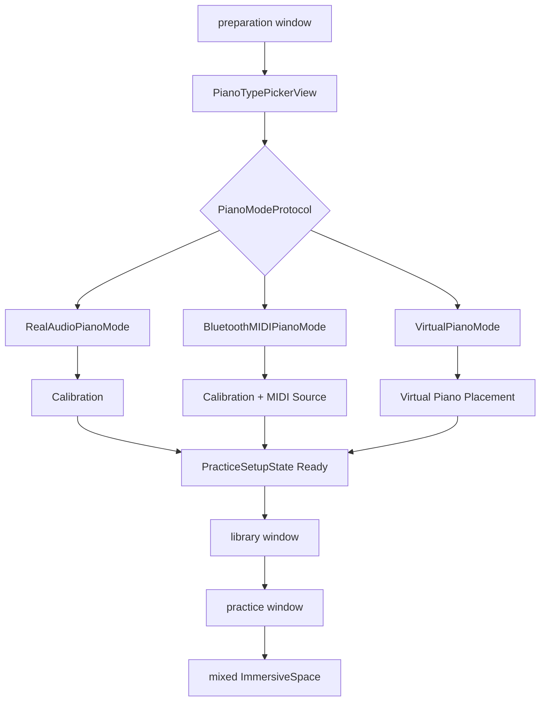
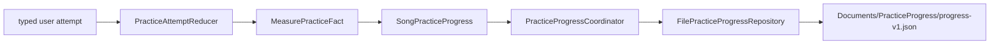
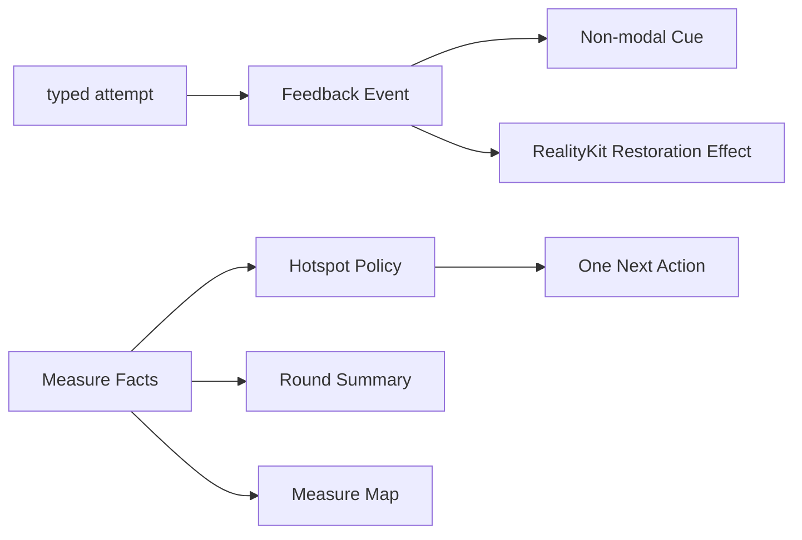
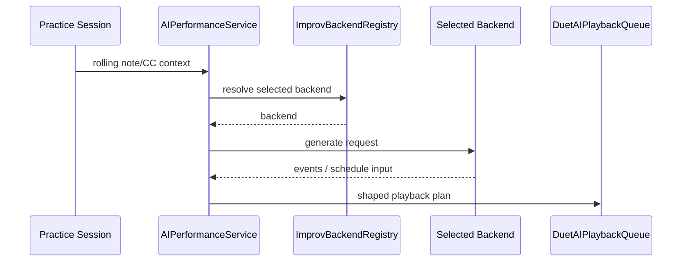

# 数据流

本文只描述当前存在的 visionOS 运行链路。

## 主流程

| 流程 | 入口 | 关键对象 | 输出 |
| --- | --- | --- | --- |
| 准备 | 钢琴模式选择 | `PracticeSetupState`、`PianoModeProtocol` | readiness gate |
| 曲库 | bundled / 用户导入 MusicXML | `SongLibraryViewModel`、`SongFileStore` | `SongLibraryEntry` |
| 曲谱准备 | 选择曲目 | `PracticePreparationService` | `PreparedPractice` |
| 练习 | prepared score + piano mode | `ARGuideViewModel`、`PracticeSessionViewModel` | 导航、判定、回放、录制 |
| 持久化 | attempt 与 session 生命周期 | reducer、coordinator、repository | 小节事实与恢复点 |
| 正反馈 | durable facts + typed attempt | feedback policies / view models | cue、summary、map、空间效果 |
| AI 对弹 | rolling context | `AIPerformanceService`、`ImprovBackendRegistry` | playback schedule |

## 窗口与准备



`WindowTransitionState` 维护 preparation、library、practice 三个窗口的替换式切换。ARKit provider 只在沉浸空间内启动。

## MusicXML 导入与准备

### 导入

```text
LibraryWindowView / SongLibraryView
-> SongLibraryViewModel.importMusicXML
-> SongFileStore
-> Documents/SongLibrary/scores
-> SongLibraryIndexStore
```

当前没有第二套 MusicXML import service。`.mxl` 在 preparation 阶段通过 `MXLReader` 解包。

### 准备管线

| 阶段 | 关键对象 | 产物 |
| --- | --- | --- |
| 读取 | `SongLibraryViewModel`、`BundledSongLibraryProvider` | score URL |
| 解析 | `MusicXMLParser`、`MXLReader` | score model |
| 钢琴归一化 | `MusicXMLPianoGrandStaffNormalizer` | 双谱表结构 |
| 展开 | `MusicXMLStructureExpander` | repeat / ending 后的 occurrence 序列 |
| 时间语义 | tempo、pedal、fermata、attribute、slur timelines | 回放和谱面上下文 |
| 分手与 step | `MusicXMLHandRouter`、`PracticeStepBuilder` | `PracticeStep[]` |
| 小节身份 | `MusicXMLMeasureSpan`、`PracticeMeasureIndex` | source / occurrence 映射 |
| 高亮与谱面 | guide builder、notation layout | 键位 guide 与五线谱输入 |
| session 注入 | `PracticeSessionViewModel` | 可开始的一轮练习 |

正式 preparation 结果必须同时有可演奏 steps 和 measure spans。解析失败或缺少小节结构时应返回加载错误，不进入推测性的兼容模式。

## 本轮配置与 active range

```text
UserDefaults defaults
-> pending PracticeRoundConfiguration
-> apply / restart
-> immutable active configuration
-> PracticeActiveRange
```

active range 同时约束：

- step 导航
- 当前谱面视口
- 琴键高亮
- autoplay
- manual replay
- 一轮完成边界

手别、速度、循环和成功目标只在应用 pending 配置并开始新一轮时生效。

## 输入与 typed attempt

| 模式 | 输入链路 | 判定 |
| --- | --- | --- |
| 真实钢琴（音频） | microphone -> recognition service -> accumulator | 目标音证据与 typed outcome |
| 真实钢琴（蓝牙 MIDI） | CoreMIDI -> MIDI1/2 decoder -> input service | deterministic note/chord matching |
| 虚拟钢琴 | hand contact -> virtual input controller | 虚拟按键 note events |

自动播放、手动回放、AI 输出、paused、suspended 与非 guiding 状态不会生成用户 attempt。

## 练习事实与恢复



规则：

- `PracticeStep` 是即时判定单位。
- source measure 是持久化学习单位。
- occurrence identity 只负责重复结构中的播放位置。
- streak 按手别、速度与本轮条件隔离。
- resume point 保存片段、配置与当前 step。
- 恢复完成后停在 ready/paused，不自动发声。
- back、background、换 session 与完成时等待 flush。

## 正反馈



反馈是事实的派生表现：

- 一次只选择一个主要卡点和一个下一步。
- 无证据时不制造问题。
- cue、summary、map 与空间效果不写入 progress JSON。
- 换曲、restart、进入后台、关闭窗口和退出沉浸空间会清理反馈 presentation。

## 录制与回放

蓝牙 MIDI 与虚拟键事件可进入：

```text
MIDIRecordingAdapter
-> RecordingTakeRecorder
-> RecordingTakeStore
-> Documents/TakeLibrary/takes.json
```

`TakePlaybackController` 复用 sequencer 回放；`RecordingMIDIExportService` 导出 `.mid`。

## AI 对弹

后端由 `practiceImprovBackendKind` 选择：

- 本地规则：`LocalRuleImprovBackend`
- 本地 CoreML：`LocalCoreMLDuetImprovBackend`
- Aria v2 HTTP：Bonjour + `POST /generate`
- Aria v2 Streaming：Bonjour + WebSocket `/stream`



后端失败只更新状态并停止该次生成，不自动降级到另一个后端，也不写入练习进度。
